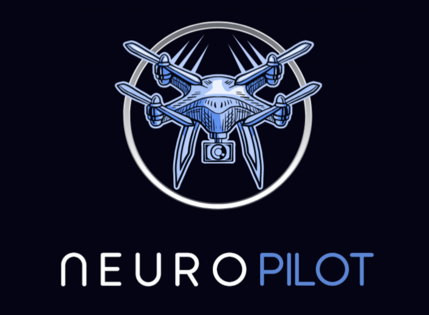

  

# NeuroPilot - EEG Brainwave Control System

NeuroPilot enables hands-free machine and robotics control using real-time EEG brainwave signals, making autonomous operation accessible through thought alone. Our adaptive BCI system learns your unique neural patterns and translates them into precise machine commands. Train your brainwave patterns for specific actions, then bind them to machine controls for drones, robots, or any automated system, opening new possibilities for assistive technology and brain-computer interface research.

## Deploy (Vultr)

| Service | URL |
|---------|-----|
| Frontend (Next.js) | http://140.82.61.96 |
| Backend (FastAPI) | http://140.82.61.96/backend |