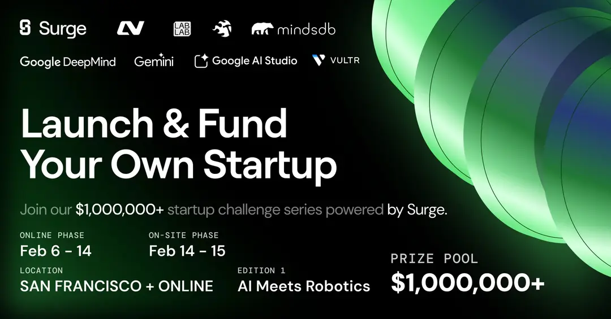

<div align="center">
  
</div>

# Neuro<span style="color: #3B82F6;">Pilot</span> - EEG Brainwave Control System

NeuroPilot enables hands-free machine and robotics control using real-time EEG brainwave signals, making autonomous operation accessible through thought alone. Our adaptive BCI system learns your unique neural patterns and translates them into precise machine commands. Train your brainwave patterns for specific actions, then bind them to machine controls for drones, robots, or any automated system, opening new possibilities for assistive technology and brain-computer interface research.

  

<div align="center">

https://lablab.ai/ai-hackathons/launch-fund-ai-meets-robotics

</div>

<div align="center">
	 
	 
	 
	 
	 
	 
	 
</div>
<div align="center">
	 
	 
</div>
<div align="center">
	 
	 
	 
	 
	 
	 
	 
</div>
<div align="center">
	 
	 
</div>
<div align="center">
	 
	 
	 
</div>
<div align="center">
	 
</div>
<div align="center">
	 
	 
</div>
<div align="center">
	 
	 
</div>
<div align="center">
	 
	 
	 
	 
</div>

## Architecture

- **Backend**: FastAPI (Python) - Custom BCI middleware handling authentication, EEG data processing, machine control, and WebSocket connections
- **Frontend**: Next.js 15 with NextAuth - Modern React application with JWT authentication, real-time visualization, and machine control interface
- **Database**: PostgreSQL - Stores user sessions, training data, EEG recordings, machines, and control bindings

**Main IP:** 45.32.121.168 — App: http://45.32.121.168:3000 | API: http://45.32.121.168:8000

### CI (GitHub Actions)

On push to `main`, `.github/workflows/docker-push-vultr.yml` runs three jobs:

1. **Build** – Docker build for backend and frontend (cache in GHA).
2. **Push** – Push images to Vultr Container Registry (`backend:latest` / `frontend:latest`).
3. **Pull** – SSH to compute VM, log in to VCR, pull latest images, then `docker compose up -d` in the project directory.

Required repo secrets: `VULTR_CR_HOST`, `VULTR_CR_NAME`, `VULTR_CR_USER`, `VULTR_CR_PASSWORD`, `VM_HOST` (VM IP), `VM_SSH_PRIVATE_KEY`. The Pull step runs in `/root/neuropilot` by default; adjust the `script` in the workflow if your app lives elsewhere.

## Quick Start

### Prerequisites

- Python 3.10+
- Node.js 18+
- PostgreSQL database
- Muse2 headset (for EEG input)
- Optional: Physical robot/drone for real-world control (system works in simulation mode)

### Platform Support

**Windows 10** - Use BlueMuse (included in `BlueMuse2/` directory)  
**Mac (M1/M2)** - Use muselsl (see `Muselsl/` directory for setup)  

### 1. Install and Start Muse Streamer

**Windows:** Use BlueMuse (see `BlueMuse2/`). Launch from Start menu, connect Muse 2.  
**Mac:** Use muselsl (see `Muselsl/README.md`). Run `cd Muselsl && python3 -m muselsl stream`.

Keep the streamer running for the next steps.

### 2. Run NeuroPilot Backend and Frontend

See [_backend/README.md](./_backend/README.md) for backend setup and run. See [_frontned/README.md](./_frontned/README.md) for frontend setup and run. Backend: `http://localhost:8000`. Frontend: `http://localhost:3000`.

### 3. Practice, Train, and Bind Controls

1. Use **Lab** for 3D simulation; use **Training** to record sessions (e.g. takeoff, land, forward).
2. In **Machines**, create or select a machine, add controls (takeoff, land, forward, etc.), and bind each Training session to the matching control. Set webhook URLs in Step 4 for real Tello.

### 4. DJI Tello: Run Backend and Set Webhooks

1. Connect laptop to Tello Wi‑Fi (SSID e.g. `TELLO-...`), power on Tello.
2. Start the DJI webhook server:
```bash
cd dji_backend
python3 -m pip install -r requirements.txt
python3 webhook_server.py
# Or: chmod +x start_webhook.sh && ./start_webhook.sh
```
Server runs at `http://localhost:8888/command` and forwards commands to the Tello via UDP.
3. In **Machines**, edit each control and set webhook URL to `http://localhost:8888/command`. The NeuroPilot backend (port 8000) proxies webhook calls to the DJI backend; the frontend does not call 8888 directly.

### 5. Connect with Tello (Brainwave Triggers Webhook)

1. Open your machine page and click **Connect**.
2. With DJI backend and Tello running, start listening; when your brainwave pattern matches a bound control, the NeuroPilot backend calls the webhook and the Tello executes the command.

### Workflow Summary

1. **Muse streamer** (Step 1) → **Backend + Frontend** (Step 2) → confirm live EEG.
2. **Lab** (simulation) → **Training** (record) → **Machines** (add controls, bind sessions).
3. **DJI backend** (Step 4) + set webhook URL on controls → **Connect** (Step 5) → brainwave triggers webhook → Tello responds.


## Features

### Core BCI Functionality
- **Real-time EEG Monitoring**: Live brainwave data visualization with frequency band analysis
- **Action Classification**: Machine learning model that translates brainwave patterns into actionable commands
- **Training Mode**: Interactive simulation game for learning and practicing brainwave control patterns
- **Event Detection**: Automatic detection of gestures and movements from EEG signals
- **WebSocket Streaming**: Real-time bidirectional data streaming between headset, backend, and frontend

### Machine Control System
- **Machine Management**: Create, configure, and manage multiple machines (drones, robots, etc.)
- **Control Binding**: Bind training sessions to specific machine controls (forward, reverse, left, right, start, stop)
- **Visual Control Mapping**: Drag-and-drop interface for positioning controls on machine blueprints
- **Per-Control Webhooks**: Set individual webhook URLs for each control to connect to external systems (e.g., DJI Tello)
- **Training-to-Control Pipeline**: Map your trained brainwave patterns directly to machine actions

### Platform Features
- **JWT Authentication**: Secure user authentication with session management
- **User Calibration**: Personalized brainwave pattern recognition per user
- **Session Management**: Track and analyze training sessions with detailed metrics
- **Real-time Visualization**: Live charts showing brainwave band powers and position trails

---

## License

For hackathon project - Launch Fund AI Meets Robotics
